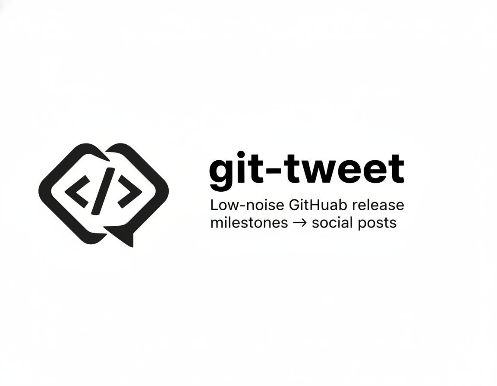

<p align="center">
  
</p>

<h1 align="center">git-tweet</h1>

<p align="center">
  Low-noise GitHub milestones → social posts.
</p>

<p align="center">
  Live: <a href="https://git-tweet.abvx.xyz/">https://git-tweet.abvx.xyz/</a>
</p>

<p align="center">
  Listed on ABVX Lab: <a href="https://lab.abvx.xyz/">https://lab.abvx.xyz/</a>
</p>

<p align="center">
  <a href="#what-it-does">What it does</a> ·
  <a href="#post-policy">Post policy</a> ·
  <a href="#quickstart">Quickstart</a> ·
  <a href="#real-end-to-end-test">Real end-to-end test</a> ·
  <a href="#local-webhook-replay">Local webhook replay</a>
</p>

<p align="center">
  
</p>

---

## What it does

`git-tweet` is a small conservative tool that watches **public GitHub repositories you explicitly activate** and auto-posts **meaningful release milestones** to social networks (currently: X and Bluesky).

The public landing page lives at [git-tweet.abvx.xyz](https://git-tweet.abvx.xyz/). The repo stays the source of truth for setup, policy, and release workflow details.

It’s designed for “I’m shipping, I forget to post” workflows:
- no AI
- no commit spam
- predictable rules
- full logging and rerun support

---

## Post policy

### Events (low-noise)
Supported in the current stage:

- **Release published**
- **First public release**
- **Major version**
- **Semver tag** (only when not covered by a release)

Not supported (intentionally out of scope in this stage):
- commits, PRs, branches, issues, stars, “milestones”, LinkedIn, queues/cron, notifications

### Dedup rules
A single release should produce **one** post:
- `FIRST_PUBLIC_RELEASE` > `MAJOR_VERSION` > `RELEASE_PUBLISHED`
- `TAG_ONLY` is used only when there is no release covering the same semver
- For repositories that already use release publishing, semver tag posts are skipped conservatively to avoid duplicate social posts

### Post format
Each post is structured for readability:

1) **What happened** (Released / Major release / First public release / Tagged)  
2) **What it is** (one-line blurb; always present)  
3) **Link** (repository URL; stable social preview is preferred over release-page cards)  
4) **0–2 hashtags** (from repo Topics; conservative normalization + optional fallback)

Example:
```text
Released v0.1.2: git-tweet

Auto-post meaningful GitHub releases to social posts (low-noise).

https://github.com/markoblogo/git-tweet

#opensource #devtools
```

### Where “what it is” comes from
In this stage:
- repo-specific overrides for key repos (e.g. `git-tweet`, `AGENTS.md_generator`)
- fallback to GitHub repository description (if present)
- final fallback: `Project update.`

### Link target policy

In the current stage, `git-tweet` always uses the **repository URL** as the post link target.

Reason:
- GitHub repository links produce more stable social preview cards than release pages
- Branding is more predictable
- The behavior stays conservative and easy to reason about

---

## Scope in this stage (personal workflow)

Included:
- GitHub OAuth connect flow
- X OAuth connect flow (default mode)
- Repository sync from connected GitHub account
- Public/private repository distinction (posting: public only)
- Explicit repository activation/deactivation
- Release/tag ingestion with webhook signature verification
- Optional shortener integration with safe fallback
- Logs/history with lifecycle clarity
- Manual rerun path for failed posts
- Local replay scripts for signed webhooks

Out of scope:
- Multi-user SaaS onboarding, billing, org roles
- LinkedIn, AI, queues/cron, notifications, advanced analytics

---

## Quickstart

### 1) Install
```bash
npm install
```

### 2) Configure env

```bash
cp .env.example .env.local
```

Minimal required:

- DATABASE_URL
- APP_URL
- GITHUB_WEBHOOK_SECRET

Plus OAuth credentials:

- GITHUB_CLIENT_ID
- GITHUB_CLIENT_SECRET
- X_CLIENT_ID
- X_CLIENT_SECRET (for confidential client apps)
- X_CONNECTION_MODE=oauth

Plus Bluesky manual mode credentials:

- BLUESKY_ENABLED=true
- BLUESKY_HANDLE
- BLUESKY_APP_PASSWORD
- BLUESKY_SERVICE_URL=https://bsky.social

### 3) Prisma

```bash
npm run db:generate
npm run db:migrate -- --name init
```

### 4) Run

```bash
npm run dev
```

Open:

- /connect/github
- /connect/x
- /connect/bluesky
- /repositories
- /logs

### Stable local mode for release testing

For day-to-day code changes, `npm run dev` is fine.

For **real webhook/release testing**, prefer production mode:

```bash
npm run serve:e2e
```

Why:
- `next dev` can occasionally produce unstable hot-reload bundles in this repo during long sessions
- `serve:e2e` uses a clean production build and is more reliable for GitHub webhook tests, reruns, and UI verification

If the dev server ever starts serving broken CSS/chunks, use:

```bash
npm run dev:clean
```

---

## Manual setup: GitHub OAuth App

1. GitHub -> Settings -> Developer settings -> OAuth Apps -> New OAuth App

2. Homepage URL:

- http://127.0.0.1:3000

3. Callback URL:

- http://127.0.0.1:3000/api/connect/github/callback

4. Copy Client ID/Secret into `.env.local`

---

## Manual setup: X OAuth 2.0 App

1. Create an X app with OAuth 2.0

2. App type:

- Web App / Automated App / Bot (confidential client)

3. Callback URL:

- http://127.0.0.1:3000/api/connect/x/callback

4. App permissions:

- Read and write

5. Scopes requested by the app (via `X_OAUTH_SCOPE`):

- tweet.read tweet.write users.read offline.access

6. Copy Client ID (+ Client Secret) into `.env.local`

---

## Manual setup: Bluesky personal mode

Bluesky is currently supported in **manual env mode** only.

Required env vars:

- `BLUESKY_ENABLED=true`
- `BLUESKY_HANDLE`
- `BLUESKY_APP_PASSWORD`
- `BLUESKY_SERVICE_URL=https://bsky.social`

Notes:

- Use an **app password**, not your main Bluesky account password
- There is **no Bluesky OAuth UI** in this stage
- If Bluesky is disabled or not configured, X posting still proceeds and Bluesky is logged as skipped

---

## Connect flows

### Connect GitHub

- Open /connect/github
- Click **Connect GitHub**
- Complete OAuth
- Click **Sync repositories**

### Connect X

- Open /connect/x
- Ensure `X_CONNECTION_MODE=oauth`
- Click **Connect X**
- Complete OAuth

### Connect Bluesky

- Open /connect/bluesky
- Set the Bluesky env vars in `.env.local`
- Restart the app
- Verify the status page shows Bluesky as configured

---

## Repository selection flow

- Open /repositories
- Filter (public, private, active, inactive)
- Activate only public repositories you want to post from
- Newly discovered public repos are synced as **inactive** by default
- Private repos are shown as unsupported and cannot be activated

---

## Use git-tweet as a posting hub for another repo

`git-tweet` can be used as a central posting hub for another public repository you own, for example `markoblogo/lab.abvx`.

Minimal flow:

1. Start `git-tweet` locally:

```bash
npm run serve:e2e
```

2. Expose it publicly with ngrok:

```bash
ngrok http 3000
```

3. In the target repository, add a GitHub webhook:

- Payload URL:
  - `https://<your-ngrok-url>/api/webhooks/github`
- Content type:
  - `application/json`
- Secret:
  - same value as `GITHUB_WEBHOOK_SECRET`
- Events:
  - `Releases`

4. In `git-tweet`:

- open `/connect/github`
- sync repositories
- open `/repositories`
- activate the target public repo

5. Publish a GitHub Release in that target repository.

Expected result:

- `/logs` shows a new event for that repo
- separate destination records appear for `X` and `BLUESKY`
- posts are published without adding any posting logic to the target repository itself

Important:

- GitHub cannot deliver webhooks to `127.0.0.1`, so a tunnel is required for local testing
- for reliable automatic posting, move the webhook to a stable public `APP_URL` instead of a temporary tunnel
- the webhook URL must include `/api/webhooks/github`
- the target repo must be explicitly activated inside `git-tweet`
- draft releases do not post; only published releases do

Optional cleanup after a pure test release:

```bash
gh release delete <tag> --repo <owner/repo> --yes
git push origin :refs/tags/<tag>
git tag -d <tag>
```

---

## Preflight checklist (make your posts look good)

Before you publish your first release and let `git-tweet` post it, spend 2 minutes on repo presentation.  
Most "ugly posts" come from missing repo metadata, not from `git-tweet`.

### 1) Repository "About" fields (GitHub Repo details)

In your repository sidebar (or Settings -> General), set:

- **Description**: a short one-liner (used as fallback for the "what it is" line)
- **Topics**: 6-10 relevant topics (used to generate 0-2 hashtags)
- **Website** (optional): project page or docs link

Tip: if Topics are empty, hashtags may be empty too.

### 2) Social preview image (GitHub Open Graph)

When posting a GitHub release/repo link, social networks typically use GitHub's **Social preview** image.

Set it once:
- Repo -> **Settings** -> **Social preview** -> upload a 1280x640 image (`assets/og.png` is a good default)

This is what becomes the card thumbnail in X and other networks.

### 3) Release hygiene

For the best post quality, make releases meaningful:
- Use semver tags (`v0.1.0`, `v1.0.0`, ...)
- Add a short release title and a few bullet points in release notes

`git-tweet` links to the repository URL for a more stable social preview card.

### 4) Sync repositories after changes

If you update repo description/topics, re-sync in `git-tweet`:
- `/connect/github` -> **Sync repositories**

That pulls updated description/topics into the local database and improves post output.

### 5) Keep it low-noise

Activate only the repos you want to post from:
- `/repositories` -> activate selected public repos

Newly discovered public repos are synced as **inactive** by default.

---

## Real end-to-end test

### Why you need a tunnel

GitHub cannot deliver webhooks to 127.0.0.1 / localhost.

For real GitHub release events you need a **publicly reachable URL** that forwards to your local dev server.

### Option A: ngrok (recommended)

1. Start the app:

```bash
npm run serve:e2e
```

2. Start ngrok in another terminal:

```bash
ngrok http 3000
```

3. Add GitHub webhook (for each test repo):  
   Repo -> Settings -> Webhooks -> Add webhook

- Payload URL:
  - https://<ngrok-id>.ngrok-free.app/api/webhooks/github

- Content type:
  - application/json

- Secret:
  - same as GITHUB_WEBHOOK_SECRET

- Events:
  - Releases
  - Branch or tag creation (optional, for tag tests)

4. Publish a release in:

- markoblogo/git-tweet
- markoblogo/AGENTS.md_generator

5. Verify:

- Open /logs
- You should see a new event + post record
- You should see separate destination rows for `X` and `BLUESKY`
- Status should be POSTED (or FAILED with a clear error)
- If POSTED, check your X timeline and Bluesky profile

### Option B: cloudflared

```bash
cloudflared tunnel --url http://localhost:3000
```

Use the provided `https://...trycloudflare.com/api/webhooks/github` as payload URL.

---

## Local webhook replay (no GitHub delivery)

Fixtures:

- fixtures/webhooks/release-published.json
- fixtures/webhooks/create-tag.json

Commands:

```bash
npm run replay:release
npm run replay:tag
```

These scripts sign payloads using GITHUB_WEBHOOK_SECRET.

This validates:

- webhook verification
- ingestion
- dedup
- tweet composition
- posting to X and Bluesky
- logs/history

But it does not validate real GitHub delivery (use a tunnel for that).

---

## Recovery for failed posts

If a release reaches `git-tweet` but one destination fails, use the built-in recovery path:

1. Fix the underlying connection issue (`/connect/x` for expired X OAuth, `/connect/bluesky` or env for Bluesky).
2. Open `/logs` and rerun the failed destination.
3. Confirm the destination row changes from `FAILED` to `POSTED`.

This is useful when webhook delivery worked, but a provider token expired after the event was ingested.

## Observability & reliability

- Private repositories are excluded from posting scope
- Newly synced public repositories stay inactive until explicitly activated
- Duplicate events are logged as SKIPPED_DUPLICATE
- Policy/guardrail skips are logged as SKIPPED_POLICY with a reason
- Shortener failures never block post creation
- Manual rerun exists for failed posts (/logs)
- Each destination is logged independently (`SYSTEM`, `X`, `BLUESKY`)

---

## API endpoints (relevant)

- POST /api/webhooks/github
- GET /api/connect/github/start
- GET /api/connect/github/callback
- POST /api/connect/github/sync
- GET /api/connect/x/start
- GET /api/connect/x/callback
- PATCH /api/repositories/:repositoryId/activation
- POST /api/posts/:postId/rerun

---

## Roadmap (intentionally small)

- Refresh-token renewal flow for X
- Bluesky OAuth UI (manual env mode is sufficient for now)
- Better error surfacing for sync/connect in UI
- Optional: editable per-repo blurb (instead of code overrides)
- Optional: additional social connectors (kept modular)
