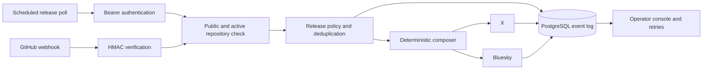

# Architecture

Git Tweet is a single-operator service. It receives GitHub release or tag
events, applies a conservative publication policy, and records an independent
delivery result for X and Bluesky.

## Core invariants

- Public repositories owned by `GITHUB_AUTO_ACTIVATE_OWNERS` activate automatically; other repositories remain inactive.
- Private repositories never publish.
- A GitHub delivery must have a valid HMAC SHA-256 signature.
- Scheduled polling requires `CRON_SECRET` and reuses the connected GitHub OAuth token.
- A release takes precedence over a tag for the same version.
- `Event.sourceKey` makes webhook ingestion idempotent.
- X and Bluesky produce separate `Post` records and failure states.
- Message composition is deterministic and does not call an AI service.

## Stored data

PostgreSQL stores the operator account, connected providers, repository
settings, normalized events, and per-destination delivery records. New GitHub
and X OAuth tokens are encrypted with `TOKEN_ENCRYPTION_KEY`; the key stays
outside the database. Bluesky credentials remain environment variables.

## Runtime boundaries

The public site at `git-tweet.abvx.xyz` is a static product overview. The
operator application is a separate protected deployment. GitHub OAuth,
webhook callbacks, and scheduled polling must use its stable `APP_URL`.

The application expects one trusted operator. It does not provide tenant
isolation, user registration, billing, scheduling, or private-repository
support.
